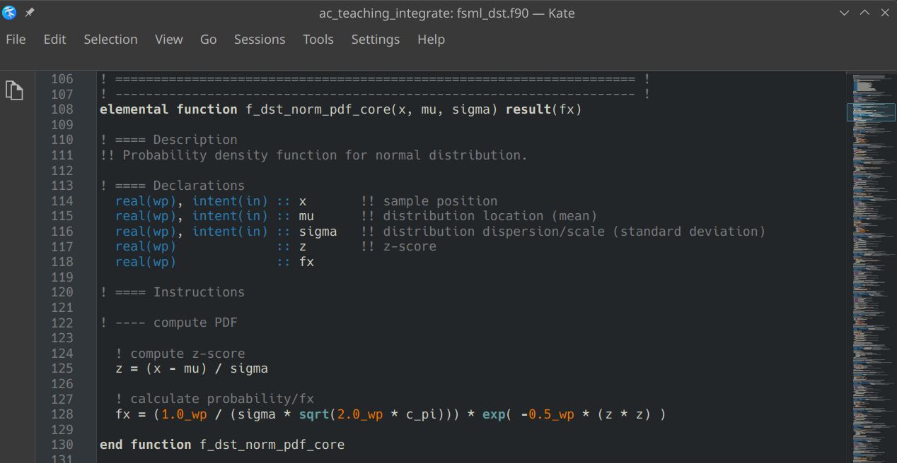
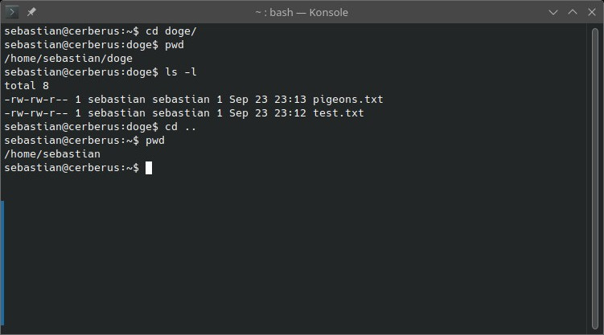

E001 (Fortran) - Getting Started
================================

In this exercise, you learn about some basic concepts of programming, commonly used tools, and how to write and execute a script. You may come across some important vocabulary that you are not yet familiar with. **We will explore this with modern Fortran (programming language).**

Information
-----------

+----------------------+--------------------------------------------------------+
| Topic                                                                         |
+======================+========================================================+
|**Concepts**          |                                                        |
|                      |   * programme                                          |
|                      |   * compilers                                          |
|                      |   * IDE, code highlighting, terminal emulator          |
|                      |   * data types                                         |
|                      |   * modules (Fortran)                                  |
+----------------------+--------------------------------------------------------+
|**Skills**            |                                                        |
|                      |   * code with only a text editor and terminal emulator |
|                      |   * create, compile and execute a programme            |
|                      |   * declaring parameters and variables                 |
|                      |   * using built-in functions                           |
+----------------------+--------------------------------------------------------+

Workflow Setup
--------------

Fortran is a compiled language. Hence, our process will be: **write code > compile code > run executable file**. This means we will need the following tools to set up our workflow:

- We will write our code in a text editor with code-highlighting feature. For demonstration purposes, we will use `Kate <https://apps.kde.org/en-gb/kate/>`_. However, there are many great editors (e.g., `Emacs <https://www.gnu.org/software/emacs/>`_).

   Text editors like *Kate* support code highlighting, which will make your code much easier to read!

- We will execute our compiled programme from command line in a terminal emulator (also referred to as console in this document). There are many great options. If you are using any Linux or Unix operating system (incl. MacOS), you will most likely have a terminal emulator already installed. If you're using Windows, installing `Cygwin <https://www.cygwin.com/>`_ is recommended. For this tutorial, demonstrations will be done with KDE's `Konsole <https://konsole.kde.org/>`_ and *bash* shell (command-line interpreter). For the exercises here, you do not need to know *bash* commands well. You only need to know 3 commands:

    1. ``ls`` lets you view the content of your working directory (the folder  you are currently in). ``ls -l`` will list the contents line-by-line.
    2. ``pwd`` (short for "print working directory") lets you find out which directory you are in.
    3. ``cd`` will change the directory you are working in. It is the equivalent of opening a folder in your file browser. For example: If you are currently in a folder ``home`` that contains a subfolder named ``doge``, you can navigate to the subfolder by typing ``cd doge``. If you want to navigate one folder level up, you simply type ``cd ..``.

   *Konsole* is one of many well-established terminal emulators. The image demonstrates some useful bash commands. The commands are written in lines starting with $ and executed by hitting enter. The results of the commands are displayed in the other lines below them.

- We will compile our code with the `gfortran <https://gcc.gnu.org/fortran/>`_ compiler. Additional installation instructions can be found `here <https://fortran-lang.org/learn/os_setup/install_gfortran/>`_. The simplest way to compile your Fortran code with gfortran is by typing the following into your terminal emulator:

.. code-block:: bash

    gfortran [path1]/[code].f90 -o [path2]/[program].exe
    ./[program].exe

With the command in the first line, you are telling the compiler to compile your script with file name *[code]* located in the folder *[path1]* and create an executable file with file name *[program]* in the folder *[path2]*. The second line will run your progam. If you are working on a Linux/Unix system, you do not need the *.exe* file extension, but it may help you identify your executables.

Writing and Compiling a Simple Programme
----------------------------------------

.. code-block:: fortran

    program printing
    implicit none

    print *, "wow, many print"

    end program

Let's go through the programme in detail:

* ``program printing`` starts the programme and gives it the name ``printing``.
* ``implicit none`` tells Fortran that every variable must be explicitly
  declared. This is an important modern Fortran programming practice.
* ``print *`` writes information to the terminal using Fortran's default
  output formatting.
* ``end program printing`` marks the end of the programme.

Save this as ``printing.f90`` and compile it with:

.. code-block:: bash

    gfortran printing.f90 -o printing

Here, we are asking for the Fortran code in file ``printing.f90`` to be converted into an execurable file named ``printing``. We can then run it with:

.. code-block:: bash

    ./printing

You can also simply combine the commands in one line using ampersands:

.. code-block:: bash

    gfortran printing.f90 -o printing && ./printing

The terminal should display::

    wow, many print

.. note::

   The Fortran Package Manager (fpm) simplifies workflows and compilations, especially for larger projects. This `short tutorial <https://fpm.fortran-lang.org/tutorial/hello-fpm.html>`_ explains how you set up a Fortran project with fpm. It is worth investing a few minutes to familiarise yourself with fpm if you want to use Fortran for the later projects in this course.

Comments
--------

Comments are text in the source code that are ignored by the compiler. In
modern Fortran, a comment begins with ``!``. For example:

.. code-block:: fortran

    ! This is a comment.
    print *, "Hello!"  ! This is also a comment.

Comments are useful for explaining *why* code exists and for documenting
assumptions. For this exercise, every executable instruction in your submitted
programme should have an explanatory comment.

Simple Maths
------------

Fortran provides arithmetic operators for common mathematical operations.

+----------+----------------------+-------------------+
| Operator | Description          | Example           |
+==========+======================+===================+
| ``+``    | addition             | ``20 + 22``       |
+----------+----------------------+-------------------+
| ``-``    | subtraction          | ``2077 - 93``     |
+----------+----------------------+-------------------+
| ``*``    | multiplication       | ``578 * 4``       |
+----------+----------------------+-------------------+
| ``/``    | division             | ``1332 / 2``      |
+----------+----------------------+-------------------+
| ``**``   | exponentiation       | ``16 ** 2``       |
+----------+----------------------+-------------------+

Try these expressions in a programme

.. code-block:: fortran

    program maths
        implicit none

        print *, 20 + 22
        print *, 2077 - 93
        print *, 578 * 4
        print *, 1332 / 2
        print *, 16 ** 2
    end program maths

The output should contain values corresponding to::

    42
    1984
    2312
    666
    256

Notice that the type of an expression matters. For example, integer division
is different from floating-point division

.. code-block:: fortran

    print *, 5 / 2
    print *, 5.0 / 2.0

The first expression uses integers, whereas the second uses real numbers.

Intrinsic Functions
-------------------

Fortran provides many intrinsic functions for common mathematical and
programming operations. These functions are built into the language and do not
require an external library.

For example, ``sqrt`` calculates a square root and ``sin`` calculates a sine

.. code-block:: fortran

    program functions
        implicit none

        print *, sqrt(64.0)
        print *, sin(2.0)
    end program functions

You can combine functions and expressions. For example

.. code-block:: fortran

    print *, sqrt(16.0 + 48.0)

The expression inside ``sqrt`` is evaluated first. Its result is then passed
to ``sqrt``.

Some useful intrinsic mathematical functions include:

* ``sqrt(x)`` -- square root
* ``abs(x)`` -- absolute value
* ``sin(x)`` -- sine
* ``cos(x)`` -- cosine
* ``exp(x)`` -- exponential
* ``log(x)`` -- natural logarithm

Fortran also provides mathematical constants through standard facilities in
modern language environments, but for this introductory exercise it is useful
to practise declaring your own constant, as shown below.

Variables and Constants
-----------------------

A variable stores a value that can change while a programme is running. A
constant (a named parameter in Fortran) stores a value that should not change.

For example

.. code-block:: fortran

    program variables
        implicit none

        real :: x
        real, parameter :: scale = 0.5
        real :: y

        x = sqrt(64.0)
        y = scale * x + 2.0

        print *, "x =", x
        print *, "y =", y
    end program variables

The declaration ``real :: x`` creates a variable named ``x`` that can store a real (floating-point) value.

The declaration ``real, parameter :: scale = 0.5`` creates a named constant. The ``parameter`` attribute means that its value cannot be changed later.

Unlike Python, Fortran requires variables to be declared before they are used. This is great, because it makes you think more carefully about what you want to do, and helps prevent problems down the line.

Data Types
----------

A data type describes what kind of value a variable can store. Common intrinsic Fortran types include:

+--------------+--------------------------------+--------------------------+
| Type         | Description                    | Example                  |
+==============+================================+==========================+
| ``integer``  | whole numbers                  | ``42``, ``451``          |
+--------------+--------------------------------+--------------------------+
| ``real``     | floating-point numbers         | ``20.77``, ``2.312``     |
+--------------+--------------------------------+--------------------------+
| ``logical``  | logical values                 | ``.true.``, ``.false.``  |
+--------------+--------------------------------+--------------------------+
| ``character``| text                           | ``"hello"``              |
+--------------+--------------------------------+--------------------------+

For example

.. code-block:: fortran

    integer :: year
    real :: temperature
    logical :: is_ready
    character(len=20) :: name

    year = 2026
    temperature = 20.77
    is_ready = .true.
    name = "Fortran"

For numerical scientific computing, it is good practice to be deliberate
about numerical precision. For this introductory exercise, ordinary
``real`` values are sufficient.

Modules
-------

Fortran uses modules to group related declarations, procedures, and constants. Modules are an important mechanism for structuring larger programmes. For a larger programme, you would normally move reusable functionality into
modules and use procedures (functions and subroutines) rather than placing all calculations in the main programme.

The following example defines a module containing a constant and a function

.. code-block:: fortran

    module geometry
        implicit none

        real, parameter :: pi = 3.141592653589793

    contains

        real function circle_area(radius)
            real, intent(in) :: radius

            circle_area = pi * radius ** 2
        end function circle_area

    end module geometry

A programme can then use the module with ``use``

.. code-block:: fortran

    program module_example
        use geometry, only: circle_area
        implicit none

        real :: area

        area = circle_area(2.0)
        print *, "area =", area
    end program module_example

The ``only`` clause makes it explicit which module entities the programme uses.
This is a useful habit in larger Fortran projects because it makes
dependencies easier to see.

The module must be compiled before, or together with, the programme that uses
it. A simple approach is to compile both source files in a single command:

.. code-block:: bash

    gfortran geometry.f90 module_example.f90 -o module_example

Your Task
---------

Now you have covered enough of the basics of practical programming to start
writing your own modern Fortran programme.

Write and submit a programme that:

* calculates and displays the circumference and area of a circle with a
  radius of 2;
* uses mathematical operators;
* uses at least one intrinsic mathematical function;
* declares and uses variables;
* declares and uses at least one named constant with ``parameter``;
* combines functions and/or expressions somewhere in the programme;
* includes comments for every executable instruction in the programme.

Save your programme as `e001.f90` and submit it.
