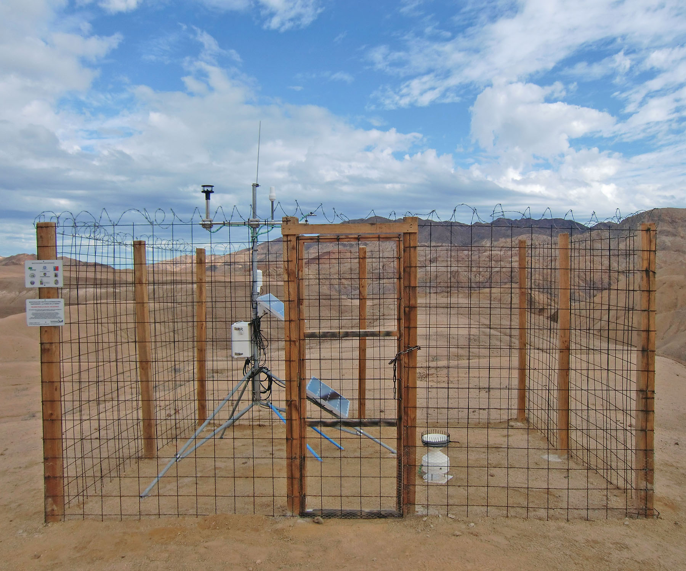

A001a - Confidence Intervals
============================

You are encouraged to re-familiarise yourself with a few topics at the start of the exercise. These are all topics we previously covered in lectures. The exercise itself is designed to give you some practice in working with these concepts to give you a more intuitive grasp of them.

Recall from Lectures
--------------------

A number of topics we covered in lectures are relevant for this exercise.

**Topic 1**: First, (re-)familiarise yourself with the **normal distribution**. Are you able to make sense of the figure, equation and labels below?

.. figure:: img/normal.jpg
   :align: center
   :figwidth: 400px

**Topic 2**: Next, you need to know about **z-scoes**. They are a standardised distance from a specific point to the mean, i.e. the distance expressed in standard deviations. In other words, the signal (distance) is put in relation to dispersion. \ :math:`\sigma` \ is the standard deviation, \ :math:`\mu` \ is the mean.

.. figure:: img/z-score.jpg
   :align: center
   :figwidth: 500px

   
**Topic 3**: Re-familiarise yourself with **sampling distributions** and **central limit theorem** and its implications. Here are a few key points:

* As sample size increases, the sample means of a random variable approaches a normal distribution even when the original variables are not normally distributed. 
* \ :math:`\mu \approx \mu_{\bar{x}}` \
* The dispersion of the sampling distribution (\ :math:`\sigma_{\bar{x}}` \) decreases as sample size increases. It can be computed as \ :math:`\sigma_{\bar{x}} = \frac {\sigma}{\sqrt {n}}` \. Since \ :math:`\sigma` \ is usually not known, the sample standard deviation **s** is often used as an approximation for \ :math:`\sigma` \, giving us an approximation for the dispersion of the sampling distribution (\ :math:`\hat{\sigma}_{\bar{x}}` \).
      
**Topic 4**: Finally, make sure you have a decent grasp on the concepts of **standard error**, **confidence intervals**, the **t-distribution** and how it is related to the normal distribution.

Exercise
--------

Information
...........

+----------------------+--------------------------------------------------------+
| Topic                                                                         |
+======================+========================================================+
|**Skills**            |                                                        |    
|                      |   * calculating common statistics                      |
|                      |   * getting a more intuitive grasp on the concepts:    |
|                      |     central limit, standard error, confidence intervals|
+----------------------+--------------------------------------------------------+

.. topic:: What to Submit

      Submit your script(s) and 1-2 sentence answers to the questions for the tasks of this exercise. You may include the answers as comments in your script(s). Make sure to also comment each of your calculations (using the terminology you were introduced to). The script should be named *a001a_[your student number].[ext]*, where *[ext]* is the file extension. In case of Python, this would be *.py*, for modern Fortran it is *.f90*, etc.
  
Temperatures in the Atacama      
...........................

   Weather station in Pan de Azucar National Park. [photo: cc-by Kirstin Übernickel]  

The Atacama desert is the driest place on Earth, and it can also get a little warm. Through careful experimentation, namely GCM (General Circulation Model) simulations, you were able to construct two models in form of PDF's (probability density functions) for summer temperatures in this desert. The simulations represent two very possible regional climate scenarios. Model 1 has a mean of 24.2°C and standard deviation of 6.1°C. Model 2 has a mean of 25.9°C and standard deviation of 5.5°C. A study suggested that mean summer temperatures above 23°C are related to increased health risks in the local population. The budget of the local goverment is large enough to keep the population healthy if the mean summer temperatures for the 30 year planning period do not exceed 24.5°C. 

**Question:** What is the probability of the local government running out of money within the given period and for each of the two regional climate scenarios?

Sampling Strategy - Reversing the Problem
.........................................

You're planning a field campaign to the Alps to collect samples of carbonates to reconstruct mean annual temperatures (MAT) for the Middle Miocene, and through some groundbreaking research, those carbonates are now able to adequately represent palaeo-MAT. You have limited time and resources, but still want to end up with a large enough sample size to be able to conduct decent research. More specifically, you want to have a sample number that allows you to be 95% confident that your true Middle Miocene MAT lies within 0.5°C of your sample mean. Temperatures constructed from similar samples of a pilot study have a standard deviation of 1.1°C.

**Question:** How many samples are you planning to take?

