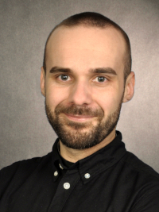

Welcome
=======

*Ahoy*, *servus* and welcome to the course! I'll be your instructor for this module. I am a senior lecturer (associate professor) and climate scientist. I study the interactions between climate and Earth surface systems using process-based and empirical models. This means a spend a lot of time developing and applying methods and models based on atmospheric physics or techniques from machine learning/artificial intelligence. I've been teaching climatology, statistics and programming for quite a few years now, so I hope can help you learn about these topics.

**Convenor:** Sebastian G. Mutz | Dr. rer. nat. habil.
**Contact:** sebastian.mutz@glasgow.ac.uk

Support
-------

Should you have any questions, queries or concerns, feel free to e-mail me and I will try to respond within 24 hours (outside of weekends). If you don’t hear back within a few days, please send your email through again. We  can also chat during/around classes or arrange a separate (in-person or online) meeting if the need arises.
