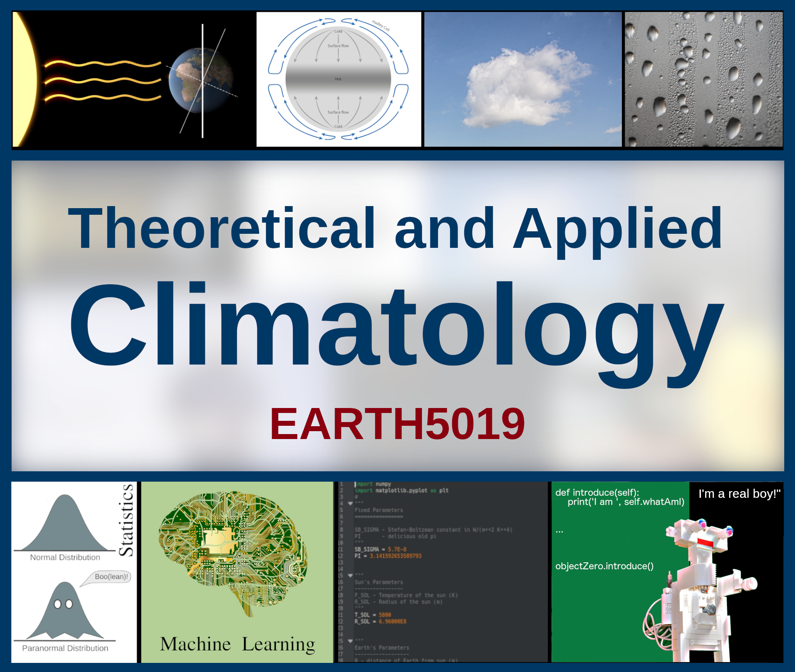

General Information
===================

This page contains general information for the course "EARTH5019: Theoretical and Applied Climatology", offered at the School of Geographical and Earth Sciences at the University of Glasgow.

Short Description
-----------------

The course provides an introduction to fundamental aspects of theoretical and applied climatology. It explores the theoretical foundations of climate science, such as celestial mechanics, first-order energy fluxes, heat and mass transport in the atmosphere, structural aspects of Earth’s climate system, rain formation, and climate change of the past, present and future. This is complemented by an introduction to important principles in applied climatology, including statistics, probability theory, empirical analysis, and modern mathematical modelling. Finally, a hands-on exploration of fundamental coding practices, and the application of some of the above-mentioned principles, will prepare you to work with climate datasets on contemporary climate-related problems in a modern research and industry work setting.

You will find the formal course specifications `here <https://www.gla.ac.uk/coursecatalogue/course/?code=EARTH5019>`_ and on our Moodle page.

Course Flexibility
------------------

The course has strong computational aspects, but I'm aware you have different reasons for doing this course. Therefore, I provide support for you completing this course with either Fortran or Python. If you're more serious about numerical modelling or research software, or already know Python and would like to learn a modern compiled language, Fortran will be a good choice. Otherwise, you may prefer Python. Either will work for this course!

Resources
---------

* Lecture and lab materials will be made available (or linked) on the "EARTH5019: Theoretical and Applied Climatology" Moodle page for this year.
* The `Python website <https://www.python.org/doc/>`_ includes beginner’s guides that can complement your general introduction to programming in the lab sessions. Similarly, the `Fortran-lang website <https://fortran-lang.org/learn/>`_ has an excellent section for learning the language, and the  `LFortran web interface <https://dev.lfortran.org/>`_ lets you experiment with Fortran in your web browser.
* For reading recommendations, see :doc:`resources section<../resources/reading>`.

