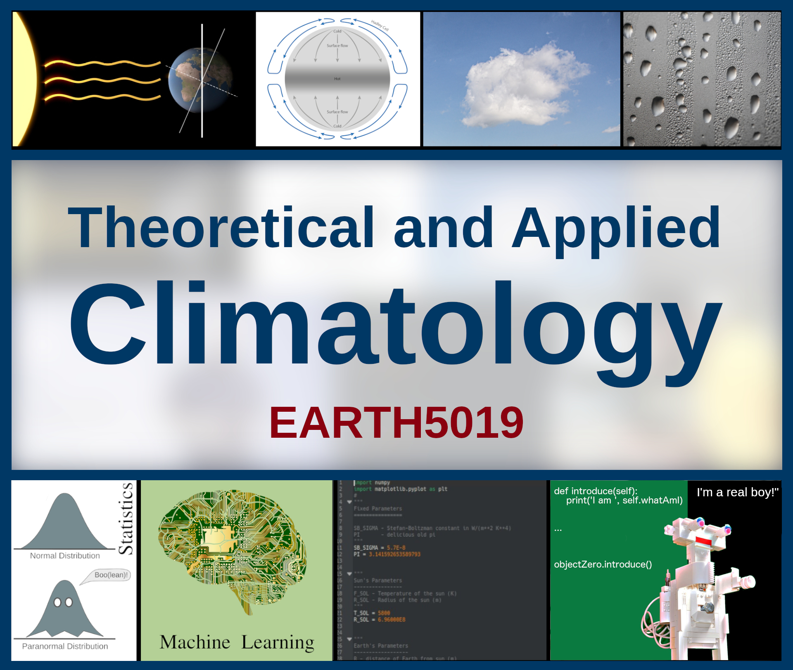

Course Specifics
================

Course Aims
-----------

This course aims to convey fundamental aspects of theoretical and applied climatology. More specifically, this course aims to:

* Equip students with an understanding of how the climate system works by introducing relevant theoretical principles.
* Develop a foundation in mathematical-statistical, empirical, and computational techniques to support the practical study of climate in particular.
* Develop programming skills to solve problems in climate science through the application of empirical analysis and modelling, and the use of climate datasets.

Intended learning outcomes (ILOs)
---------------------------------

By the end of this course students will be able to:

* Explain the physical causes for past, present and future states of the climate system.
* Explain the strengths and limitations of commonly used mathematical techniques in climate science.
* Apply theoretical concepts of empirical analysis, mathematical modelling and coding practices.
* Analyse (quantitatively) typical problems in climate science through the application of the above techniques.
* Evaluate research outcomes with regards to their potential uses, application and limitations for solving climate-related problems.

Modes of Learning
-----------------

The course combines lectures and practical classes in three-hour workshops. The first 5 weeks will mostly consist of lectures, while the last 5 weeks will mostly consist of practicals that are designed to (1) apply some of the theoretical knowledge gained from the lectures, and (2) acquire some coding and data analysis skills. However, we will maintain some flexibility to be able to make ad hoc changes to respond to student learning needs. The exercises given during the workshops will take longer than the timetabled slots, and students are expected to finish the exercise in their own working time. Students are encouraged to use contact hours for practicals to take advantage of the teacher’s support, ask questions and ensure they are able to finish the exercises in their own time.

Assessments
-----------

Formative Assessment
....................

Ongoing informal assessment and verbal feedback will be available through discussion during lectures and labs. I (course convenor) am also happy to discuss the course and student’s progress out-of-class. You are encouraged to write me an e-mail to arrange for such a discussion.

Summative Assessment
....................

* A report that presents and discusses the outcomes of a data analysis or model development group project (50%),
* An oral presentation to communicate and evaluate the group project outcomes (25%),
* Submissions of the student's solutions to a series of exercises (25%).

