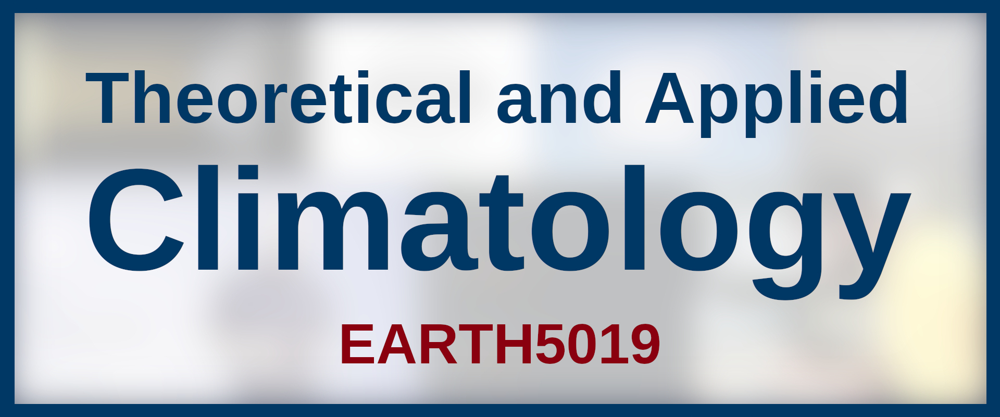

.. integrate documentation master file, created by
   sphinx-quickstart on Mon Jan 21 20:21:55 2019.
   You can adapt this file completely to your liking, but it should at least
   contain the root `toctree` directive.

Course Website
==============

Getting Started!
----------------
This website is supplementary material for the course "EARTH5019: Theoretical and Applied Climatology" listed on the University of Glasgow Moodle site. Students can get an overview of the course in the :doc:`general information section<general/info>` and a more detailed overview of the course contents in the :doc:`course specifics section<general/syllabus>`. A detailed timetable and assessment deadlines can be found in the :doc:`when and where section<general/timetable>`.

.. note:: Assessment criteria and other important information are copied here for your convenience, so you have all course content and information in the same place! I will do my best to keep everything up-to-date here. However, if any information deviates from that given on **Moodle** or the official **Course Handbook** (uploaded on Moodle), the information from the latter sources are to be regarded as correct.

Table of Contents
-----------------    
    
.. toctree::
   :maxdepth: 1
   :caption: Course Information:
   
   general/info
   general/syllabus
   general/timetable

.. toctree::
   :maxdepth: 1
   :caption: Exercises (Coding):

   exercises/info
   exercises/E001/py/E001
   exercises/E002/py/E002
   exercises/E003/py/E003
..    exercises/E004/py/E004
..    exercises/E005/py/E005

.. toctree::
   :maxdepth: 1
   :caption: Assignments:

   exercises/E101/E101
   exercises/E102/E102
   exercises/E105/E105
..    exercises/E103/E103
..    exercises/E104/E104

..
.. .. toctree::
..    :maxdepth: 1
..    :caption: Projects:
..
..    projects/P001/P001_info
..    projects/P002/P002_info
..    projects/P003/P003_info
..    projects/P004/P004_info
..    projects/P005/P005_info
..    projects/P006/P006_info
..    projects/P007/P007_info
..    projects/P008/P008_info
..    projects/P009/P009_info

.. toctree::
   :maxdepth: 1
   :caption: Additional Resources:
   
   resources/dictionary
   resources/reading
   resources/data
   resources/credits

